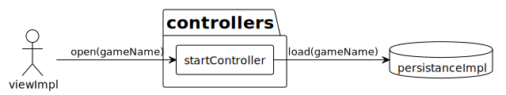
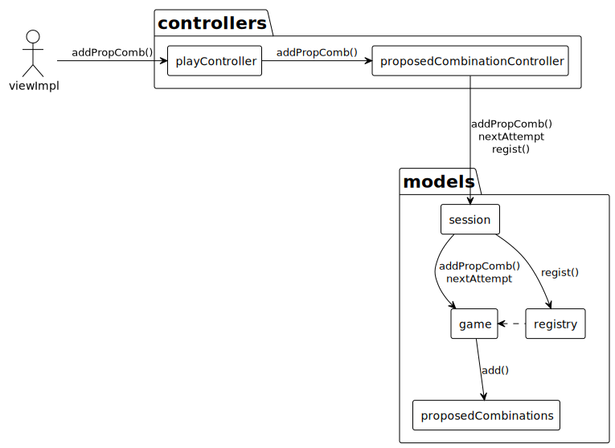
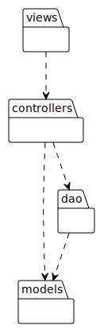
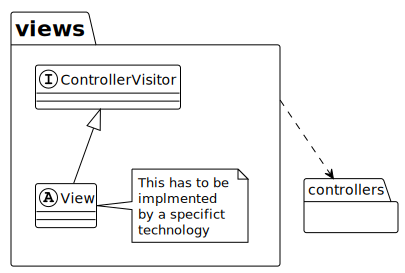
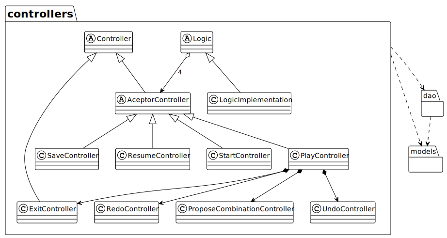
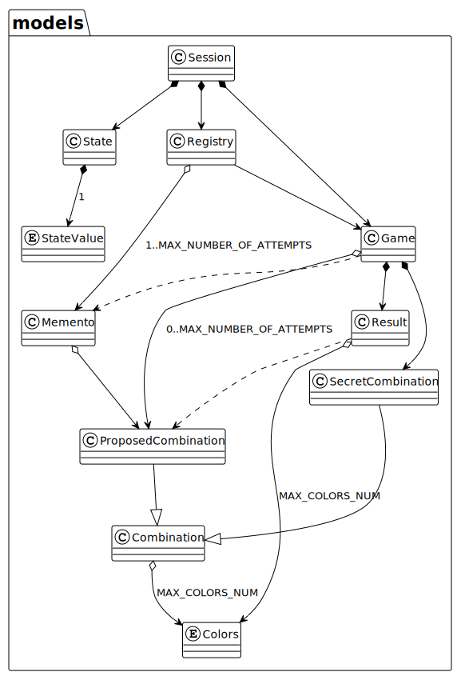
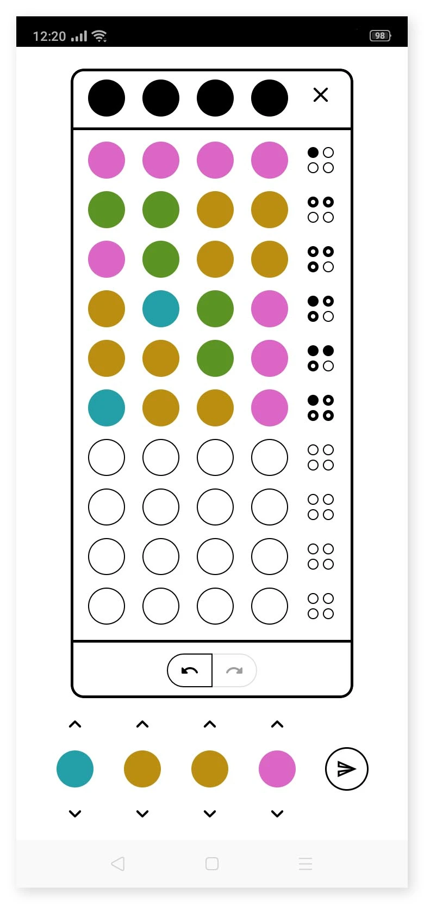
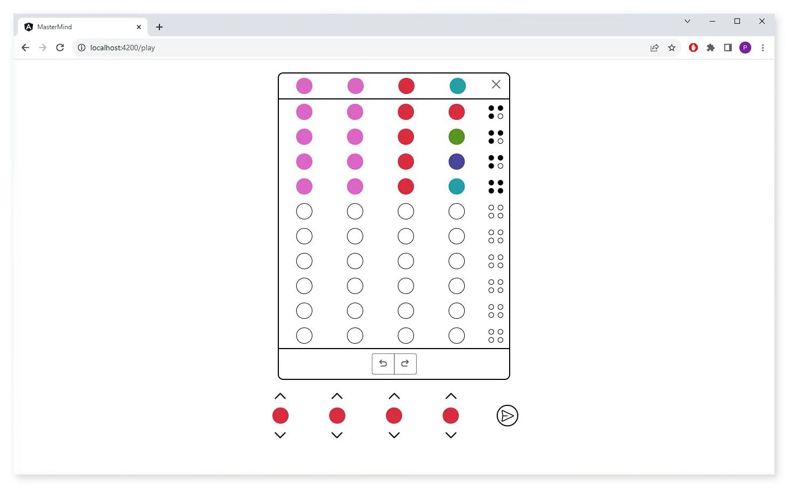

# Multiplatform Game

### Index
- **[Description](#description)**
- **[Application development](#application-development)**
- **[Documentation](#documentation)**
  - **[Domain Model](#domain-model)**
  - **[Use Case](#use-case)**
  - **[Context Diagram](#context-diagram)**
  - **[Colaboration Diagram 'Open Case'](#colaboration-diagram-open-case)**
  - **[Colaboration Diagram 'ProposeCopmbination Case'](#colaboration-diagram-proposecombination-case)**
  - **[Architecture](#architecture)**
  - **[View Analysis Diagram](#view-analysis-diagram)**
  - **[Controllers Analysis Diagram](#controllers-analysis-diagram)**
  - **[DAOs Analysis Diagram](#daos-analysis-diagram)**
  - **[Models Analysis Diagram](#models-analysis-diagram)**
- **[User Interface](#user-interface)**
  - **[Andorid Application](#andorid-application)**
  - **[Web Application](#web-application)**

## Description

This project is based on a modular design, where the application "core/business logic" is an independent module that exposes the corresponding interfaces so it can be implemented by different technologies for viewing and persistence.

**Here is the code of the application core:**
- **[Application core](https://github.com/PacoMorando/master-mind-core)**

The exercise aim was to learn how to design systems open to the extension of both deployment as well as requirements implementing a modular architectural design.  
It also puts into practice my studies in object-oriented design, design patterns, software architecture, and development methodologies.

As a result of this, it is possible to use the same code to develop a console, an android application and a Rest API that can be consumed by a web application.

**Here you can check the code of each implementation:**  
- **[Console implementation](https://github.com/PacoMorando/master-mind-console)**
- **[Android implementation](https://github.com/PacoMorando/master-mind-android)**
- **[API  implementation](https://github.com/PacoMorando/master-mind-api)**
- **[Web application](https://github.com/PacoMorando/master-mind-web)** *This is the code of the web application that consumes the API implementation.*

>**Note:**  
Since the  [game](https://es.wikipedia.org/wiki/Mastermind)  has very simple rules, the "undo/redo" use cases were added. Although they make the game lose the sense, they were added to complicate the system a little more and have the chance of putting into practice some design patterns.

## Application development

The core of the application was developed in Java. This module contains the model logic and a layer of controllers that are responsible for controlling the flow of program execution, as well as managing data entry and exit of the application.  
The core of the application is agnostic to thetechnologies of view and persistence, which is why controllers are coupled to interfaces of the view and persistence layers (DAO), within same component, which must be implemented by each corresponding technology.

[The application core](https://github.com/PacoMorando/master-mind-core)  is packaged to be imported as a maven dependency.  
This component exposes two interfaces, one for the view technology and another for the persistence.

For example, [the console application](https://github.com/PacoMorando/master-mind-console)  implements views to display a text-based dashboard that shows the messages with the information extracted from the core component, thus the implementation It is only responsible for printing messages and validating user input data. To implement the persistence it uses FileWriter to save game data as plain text.

[The android application](https://github.com/PacoMorando/master-mind-android) uses its view technology (Activities, Framents) and SQLite for the persistence of games.  
In the case of web distribution, I developed a [Rest API](https://github.com/PacoMorando/master-mind-api) using SpringBoot. The API implements the view interface from the core (maven dependency) as "end points" that are exposed to be consumed by an [application website](https://github.com/PacoMorando/master-mind-web) that was developed in Angular. In this way the logic and control of execution flow remains in the backend.

## Documentation

### Domain Model

### Use Case

### Context Diagram

### Colaboration Diagram Open Case

### Colaboration Diagram 'ProposeCombination Case'

### Architecture

### View Analysis Diagram

### Controllers Analysis Diagram

### DAOs Analysis Diagram

### Models Analysis Diagram

## User Interface

### Andorid Application 

### Web Application 

